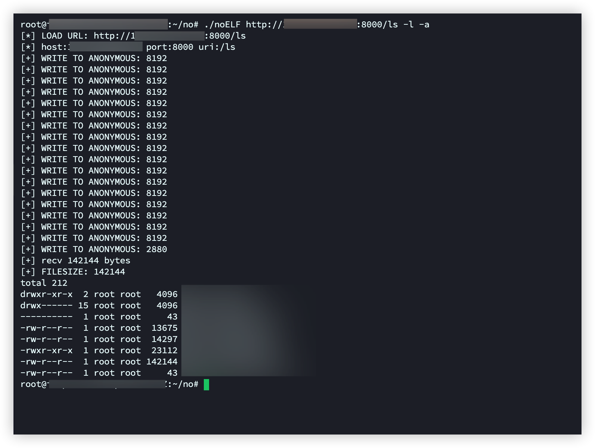

# noELF
通过syscall创建匿名文件将elf写入后执行，支持远程加载可执行文件达到内存加载的目的。

部分代码参考自ateam ptrace项目，但考虑到内核环境适配以及局限性的问题，没有使用项目中提到采用fork并修改子进程栈中要执行内容的做法。

## 用法

```
./noELF {PATH/URL} {argv}
```

本地ELF文件加载

```
./noElf /bin/ls -al
```

远程ELF文件加载

```
python3 -m http.server 8000
./noElf http://10.10.10.10:8000/ls -al
```

## 案例



## 待完成

支持解析域名但未实现https协议下的socket传输
